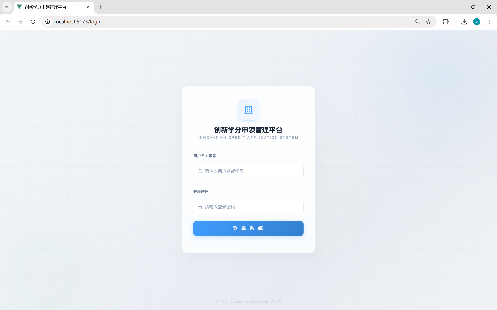
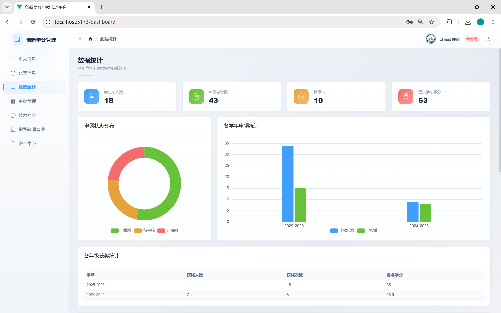
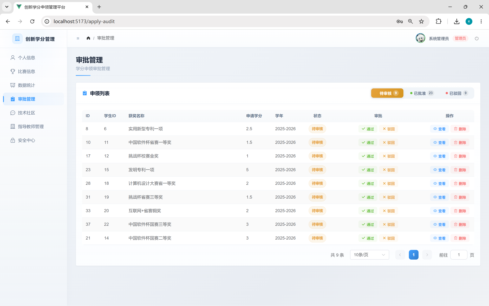
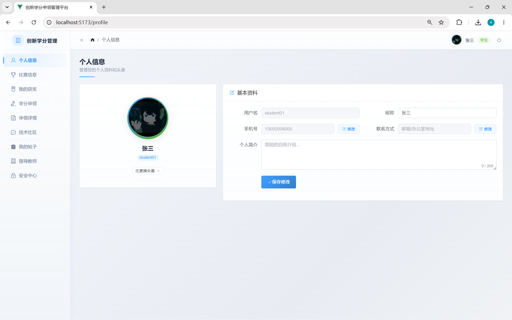
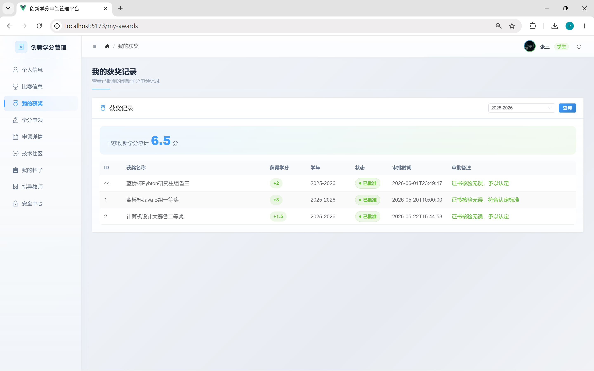
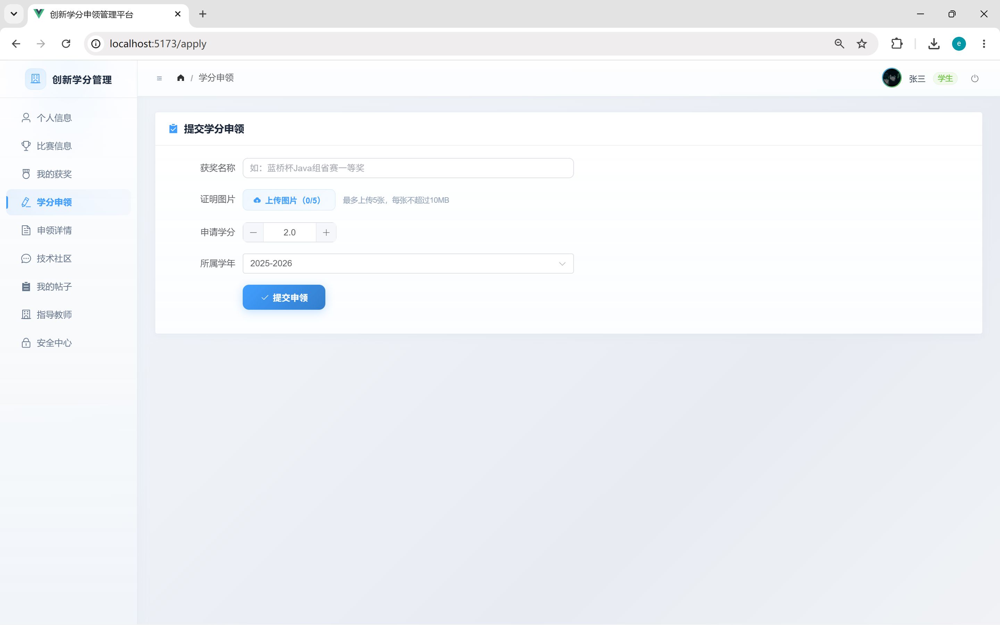
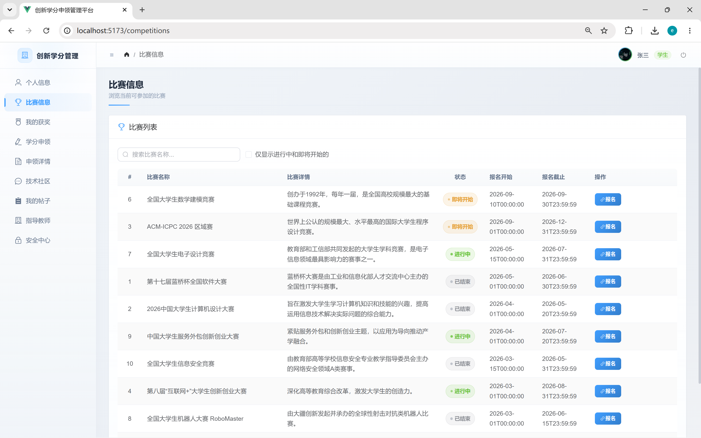
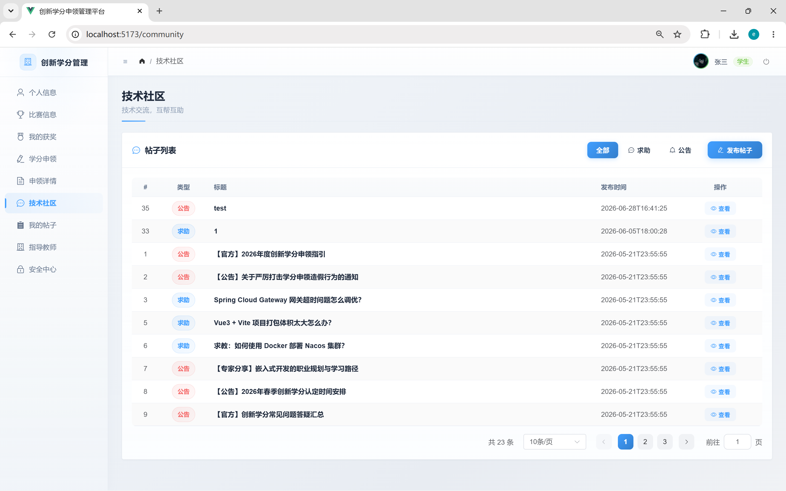

# 创新学分申领管理平台

<p align="center">
  
  
  
  
  
  
  
</p>

基于 Spring Cloud 微服务架构的创新学分申领管理系统，提供完整的学分申请、审核、统计和管理功能。

## 项目简介

本项目采用前后端分离架构，后端使用 Spring Cloud 微服务技术栈，前端使用 Vue 3 + Element Plus，实现了一个完整的创新学分管理平台。系统支持学生提交学分申请、教师审核、管理员管理、数据统计分析等功能，并提供了社区交流模块。

## 技术栈

### 后端技术
- **Spring Boot 3.2.5** - 服务开发框架
- **Spring Cloud 2023.0.1** - 微服务框架
- **Spring Cloud Alibaba 2023.0.1.0** - 微服务组件
- **Spring Cloud Gateway** - API 网关
- **MyBatis Plus 3.5.6** - 数据持久层
- **MySQL 8.0.33** - 数据库
- **Druid 1.2.20** - 数据库连接池
- **Knife4j 4.5.0** - API 文档
- **JWT 0.12.5** - 身份认证
- **Fastjson 2.0.49** - JSON 处理

### 前端技术
- **Vue 3.5** - 前端框架
- **Element Plus 2.8** - UI 组件库
- **Vite 6.0** - 构建工具
- **Pinia 2.2** - 状态管理
- **Vue Router 4.4** - 路由管理
- **Axios 1.7** - HTTP 客户端
- **ECharts 6.1** - 数据可视化

## 项目架构

系统采用微服务架构，包含以下服务模块：

- **credit-gateway** - API 网关服务，统一入口、路由转发、认证过滤
- **credit-auth** - 认证服务，用户登录、JWT 令牌生成
- **credit-user** - 用户服务，用户信息管理、文件上传
- **credit-apply** - 学分申领服务，申请管理、审核流程、数据统计
- **credit-competition** - 竞赛服务，竞赛信息管理
- **credit-community** - 社区服务，帖子发布、回复管理
- **credit-common** - 公共模块，通用工具类、实体类

## 功能特性

### 学生端
- 学分申请提交
- 查看申请状态和审核结果
- 查看个人学分统计
- 参与社区交流
- 浏览竞赛信息

### 管理员端
- 审核学分申请
- 查看学生学分记录
- 数据统计分析（按年级、班级统计）
- 查看优秀学生榜单
- 编辑教师信息
- 用户管理

### 数据统计
- 学分申请状态统计
- 按年级分布统计
- 按班级分布统计
- 优秀学生排行榜
- 年度趋势分析

## 项目预览

### 登录界面


### 管理员仪表盘


### 管理员审批管理


### 个人信息


### 学生获奖记录


### 学生提交学分申请


### 竞赛信息


### 技术社区


## 快速开始

### 环境要求
- JDK 17
- Maven 3.6+
- MySQL 8.0+
- Node.js 16+

### 后端启动

1. 创建数据库并导入数据
```bash
mysql -u root -p < init.sql
```

2. 修改各服务的 `application.yml` 配置文件，配置数据库连接信息

3. 编译打包
```bash
mvn clean package
```

4. 按顺序启动服务
```bash
# 1. 启动网关
java -jar credit-gateway/target/credit-gateway-1.0.0.jar

# 2. 启动认证服务
java -jar credit-auth/target/credit-auth-1.0.0.jar

# 3. 启动其他服务...
java -jar credit-user/target/credit-user-1.0.0.jar
java -jar credit-apply/target/credit-apply-1.0.0.jar
java -jar credit-competition/target/credit-competition-1.0.0.jar
java -jar credit-community/target/credit-community-1.0.0.jar
```

### 前端启动

1. 进入前端目录
```bash
cd credit-web
```

2. 安装依赖
```bash
npm install
```

3. 启动开发服务器
```bash
npm run dev
```

4. 访问 http://localhost:5173

## 项目结构

```
credit-system/
├── credit-gateway/        # API 网关
├── credit-auth/           # 认证服务
├── credit-user/           # 用户服务
├── credit-apply/          # 学分申领服务
├── credit-competition/    # 竞赛服务
├── credit-community/      # 社区服务
├── credit-common/         # 公共模块
├── credit-web/            # 前端应用
├── init.sql               # 数据库初始化脚本
└── pom.xml                # Maven 父工程配置
```

## API 文档

启动服务后，访问以下地址查看 API 文档：

- 用户服务：http://localhost:8081/doc.html
- 学分申领服务：http://localhost:8082/doc.html
- 竞赛服务：http://localhost:8083/doc.html
- 社区服务：http://localhost:8084/doc.html

## 数据库设计

主要数据表：
- `user` - 用户信息表
- `credit_apply` - 学分申请表
- `competition` - 竞赛信息表
- `community_post` - 社区帖子表
- `post_reply` - 帖子回复表

详细设计文档请参考 `图表设计/` 目录下的 ER 图和功能结构图。

## 开发说明

### 配置文件
各服务的配置文件位于 `src/main/resources/application.yml`，主要配置项：
- 服务端口
- 数据库连接
- Gateway 路由规则
- JWT 密钥

### 认证机制
系统使用 JWT 进行身份认证，流程如下：
1. 用户登录 -> 认证服务验证 -> 生成 JWT
2. 前端携带 JWT -> Gateway 过滤验证 -> 转发请求
3. 各服务解析 JWT 获取用户信息

## 作者

Neon

## 许可证

本项目采用 MIT 许可证，详见 [LICENSE](LICENSE) 文件。
