# 创新学分申领管理平台 - 传统ER图设计

## 一、完整ER图

使用Mermaid graph语法绘制的传统ER图（矩形=实体，圆形=属性，菱形=关系）：

```mermaid
graph LR
    %% ==================== 标题 ====================
    Title[创新学分申领管理平台ER图]
    style Title fill:#fff,stroke:#fff,color:#333,font-size:20px,font-weight:bold
    
    %% ==================== 用户实体 ====================
    User["<b>用户</b><br/>sys_user"]
    
    UserId(("id<br/>PK"))
    Username(("username<br/>UK"))
    Password(("password"))
    Nickname(("nickname"))
    Avatar(("avatar"))
    Phone(("phone"))
    Role(("role"))
    Bio(("bio"))
    ContactInfo(("contact_info"))
    UserStatus(("status"))
    UserCreateTime(("create_time"))
    UserUpdateTime(("update_time"))
    
    User --- UserId
    User --- Username
    User --- Password
    User --- Nickname
    User --- Avatar
    User --- Phone
    User --- Role
    User --- Bio
    User --- ContactInfo
    User --- UserStatus
    User --- UserCreateTime
    User --- UserUpdateTime
    
    %% ==================== 比赛实体 ====================
    Competition["<b>比赛信息</b><br/>sys_competition"]
    
    CompId(("id<br/>PK"))
    CompTitle(("title"))
    CompContent(("content"))
    CompStartTime(("start_time"))
    CompEndTime(("end_time"))
    CompRegUrl(("registration_url"))
    CompCreateTime(("create_time"))
    CompUpdateTime(("update_time"))
    
    Competition --- CompId
    Competition --- CompTitle
    Competition --- CompContent
    Competition --- CompStartTime
    Competition --- CompEndTime
    Competition --- CompRegUrl
    Competition --- CompCreateTime
    Competition --- CompUpdateTime
    
    %% ==================== 学分申领实体 ====================
    Apply["<b>学分申领</b><br/>sys_credit_apply"]
    
    ApplyId(("id<br/>PK"))
    UserIdFK(("user_id<br/>FK"))
    AwardTitle(("award_title"))
    ImageUrl(("image_url"))
    CreditScore(("credit_score"))
    ApplyStatus(("status"))
    AuditRemark(("audit_remark"))
    AuditTime(("audit_time"))
    AuditorIdFK(("auditor_id<br/>FK"))
    AcademicYear(("academic_year"))
    ApplyCreateTime(("create_time"))
    ApplyUpdateTime(("update_time"))
    
    Apply --- ApplyId
    Apply --- UserIdFK
    Apply --- AwardTitle
    Apply --- ImageUrl
    Apply --- CreditScore
    Apply --- ApplyStatus
    Apply --- AuditRemark
    Apply --- AuditTime
    Apply --- AuditorIdFK
    Apply --- AcademicYear
    Apply --- ApplyCreateTime
    Apply --- ApplyUpdateTime
    
    %% ==================== 社区帖子实体 ====================
    Post["<b>社区帖子</b><br/>sys_community_post"]
    
    PostId(("id<br/>PK"))
    PostUserId(("user_id<br/>FK"))
    PostTitle(("title"))
    PostContent(("content"))
    PostType(("post_type"))
    PostCreateTime(("create_time"))
    PostUpdateTime(("update_time"))
    
    Post --- PostId
    Post --- PostUserId
    Post --- PostTitle
    Post --- PostContent
    Post --- PostType
    Post --- PostCreateTime
    Post --- PostUpdateTime
    
    %% ==================== 帖子回复实体 ====================
    Reply["<b>帖子回复</b><br/>sys_post_reply"]
    
    ReplyId(("id<br/>PK"))
    PostIdFK(("post_id<br/>FK"))
    ReplyUserId(("user_id<br/>FK"))
    ReplyNickname(("nickname"))
    ReplyContent(("content"))
    ReplyCreateTime(("create_time"))
    
    Reply --- ReplyId
    Reply --- PostIdFK
    Reply --- ReplyUserId
    Reply --- ReplyNickname
    Reply --- ReplyContent
    Reply --- ReplyCreateTime
    
    %% ==================== 关系 ====================
    Submit{"提交申请"}
    Publish{"发布帖子"}
    Audit{"审批申请"}
    ReplyPost{"回复帖子"}
    
    User ===|1| Submit
    Submit ===|N| Apply
    
    User ===|1| Publish
    Publish ===|N| Post
    
    User ===|1| Audit
    Audit ===|N| Apply
    
    User ===|1| ReplyPost
    ReplyPost ===|N| Reply
    
    Post ===|1| ReplyPost
    ReplyPost ===|N| Reply
    
    %% ==================== 样式定义 ====================
    classDef entity fill:#1E88E5,stroke:#1565C0,stroke-width:2px,color:white,font-weight:bold
    classDef attribute fill:#4DB6AC,stroke:#00897B,stroke-width:1px,color:white
    classDef relation fill:#FFB74D,stroke:#F57C00,stroke-width:2px,color:white,font-weight:bold
    classDef primaryKey fill:#E57373,stroke:#D32F2F,stroke-width:1px,color:white
    classDef foreignKey fill:#81C784,stroke:#388E3C,stroke-width:1px,color:white
    classDef uniqueKey fill:#64B5F6,stroke:#1976D2,stroke-width:1px,color:white
    
    class User,Competition,Apply,Post,Reply entity
    class Submit,Publish,Audit,ReplyPost relation
    class UserId,CompId,ApplyId,PostId,ReplyId primaryKey
    class Username uniqueKey
    class UserIdFK,AuditorIdFK,PostUserId,PostIdFK,ReplyUserId foreignKey
```

**样式说明**（参考传统ER图标准样式）：
- **蓝色矩形**：实体（Entity）- 用户、比赛、学分申领、社区帖子、帖子回复
- **青色圆形**：属性（Attribute）- 各实体的字段属性
- **橙色菱形**：关系（Relationship）- 提交申请、发布帖子、审批申请、回复帖子
- **红色圆形**：主键属性（PK）- 各实体的唯一标识
- **绿色圆形**：外键属性（FK）- 用于关联其他实体的字段
- **浅蓝色圆形**：唯一键属性（UK）- 唯一性约束的字段

---

## 二、分模块ER图

### 2.1 用户实体及其属性

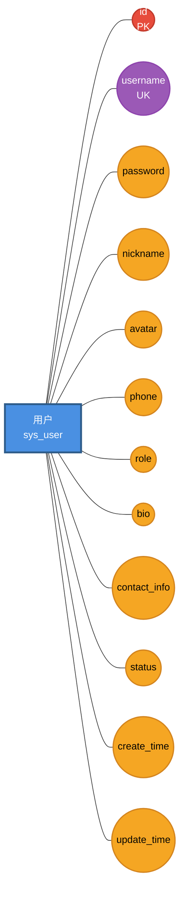

**关键字说明**：
- **PK（红色）**：Primary Key，主键
- **UK（紫色）**：Unique Key，唯一键

---

### 2.2 比赛实体及其属性

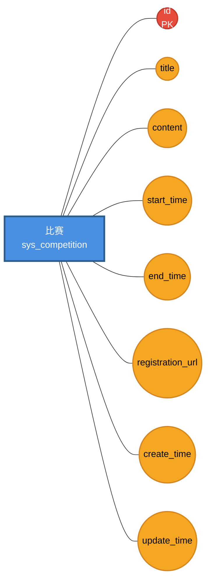

---

### 2.3 学分申领实体及其属性

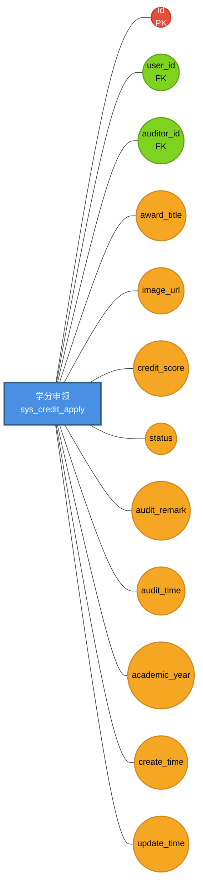

**外键说明**：
- **FK（绿色）**：Foreign Key，外键
  - `user_id`：关联用户表的申请学生
  - `auditor_id`：关联用户表的审批人

---

### 2.4 社区帖子实体及其属性

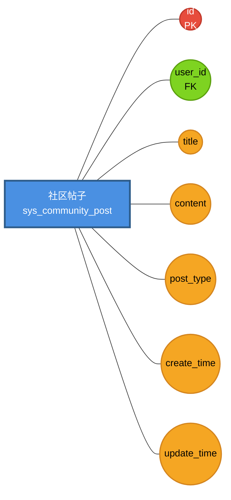

---

### 2.5 帖子回复实体及其属性

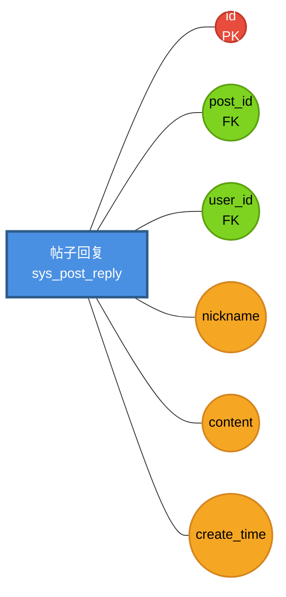

---

## 三、实体关系图

### 3.1 用户与学分申领的关系

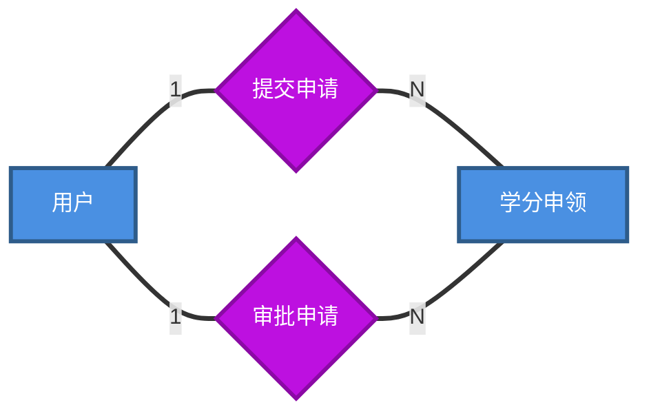

**关系说明**：
- **提交申请**：一个用户可以提交多条学分申请（1:N）
- **审批申请**：一个管理员可以审批多条学分申请（1:N）

---

### 3.2 用户与社区帖子的关系

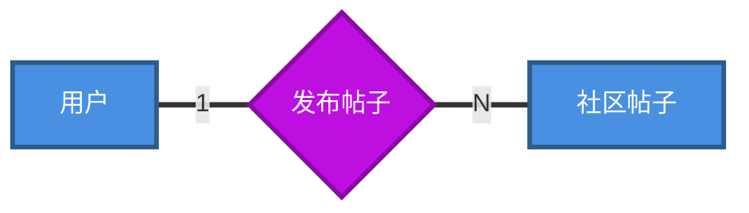

**关系说明**：
- **发布帖子**：一个用户可以发布多条帖子（1:N）

---

### 3.3 帖子与回复的关系

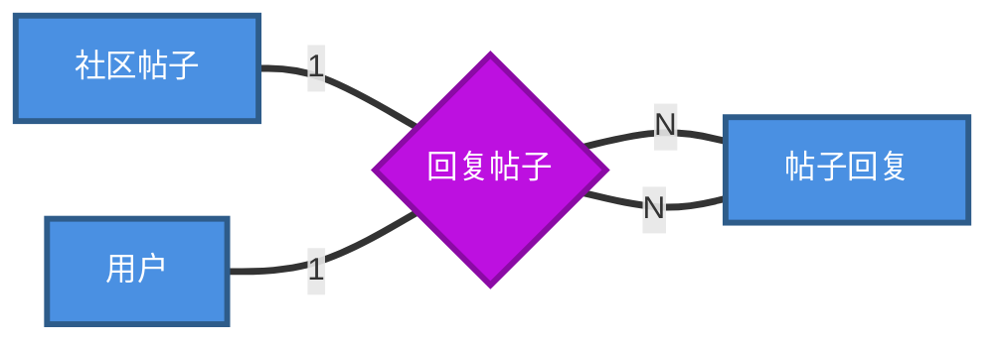

**关系说明**：
- **回复帖子**：一条帖子可以有多条回复（1:N）
- **回复帖子**：一个用户可以发布多条回复（1:N）

---

### 3.4 完整关系图

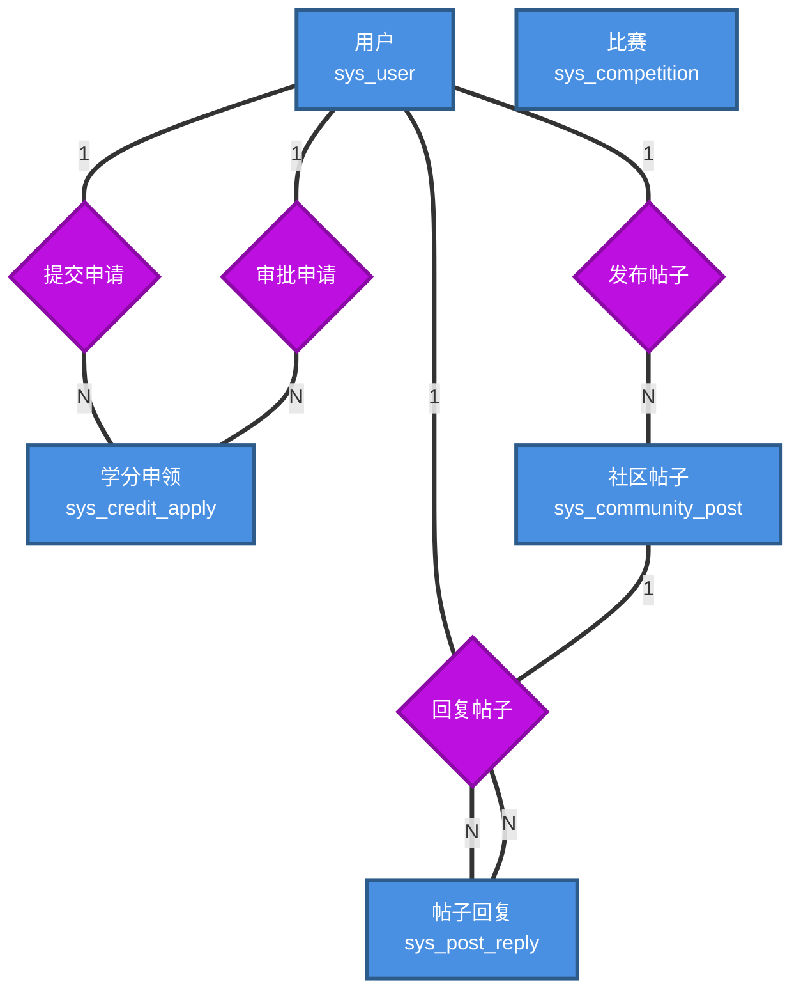

---

## 四、ER图符号说明

### 4.1 传统ER图符号

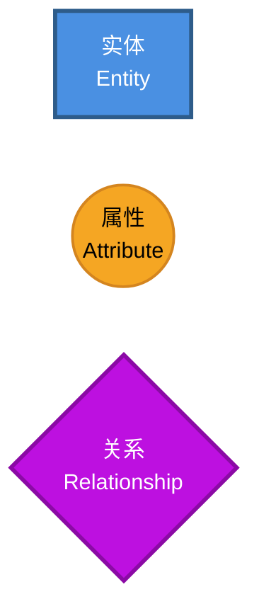

**符号含义**：
- **矩形**：表示实体（Entity），即现实世界中的对象，如用户、比赛、帖子等
- **圆形/椭圆**：表示属性（Attribute），即实体的特征，如姓名、时间、状态等
- **菱形**：表示关系（Relationship），即实体之间的联系，如提交、发布、回复等

### 4.2 连线类型说明

| 连线样式 | 含义 |
|---------|------|
| `---` | 连接实体与属性 |
| `===` | 连接实体与关系 |
| `|1` | 一端（One） |
| `|N` | 多端（Many） |
| `|M` | 多端（Many，用于M:N关系） |

### 4.3 关系基数说明

**基数类型**：
- **1:1（一对一）**：一个实体A对应一个实体B
- **1:N（一对多）**：一个实体A对应多个实体B
- **M:N（多对多）**：多个实体A对应多个实体B（通常需要中间表）

---

## 五、属性类型说明

### 5.1 主键属性

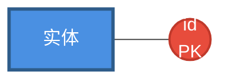

**主键（Primary Key）**：
- 用红色椭圆表示
- 每个实体必须有且仅有一个主键
- 主键值唯一标识实体中的每个实例
- 通常使用自增ID

### 5.2 外键属性

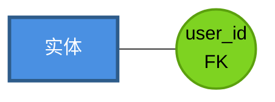

**外键（Foreign Key）**：
- 用绿色椭圆表示
- 用于建立实体之间的关联
- 外键值必须引用另一个实体的主键值
- 保证数据的参照完整性

### 5.3 唯一键属性

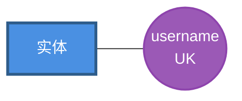

**唯一键（Unique Key）**：
- 用紫色椭圆表示
- 确保属性值在实体中唯一
- 例如用户名、学号等不能重复

### 5.4 普通属性

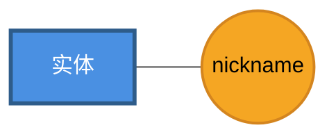

**普通属性**：
- 用橙色椭圆表示
- 实体的基本特征信息
- 允许值重复

---

## 六、数据表与ER图对照

### 6.1 sys_user（用户表）

| ER图属性 | 数据表字段 | 类型 | 说明 |
|---------|-----------|------|------|
| id（PK） | id | BIGINT | 主键，自增 |
| username（UK） | username | VARCHAR(50) | 用户名，唯一 |
| password | password | VARCHAR(100) | 密码 |
| nickname | nickname | VARCHAR(50) | 昵称 |
| avatar | avatar | VARCHAR(255) | 头像URL |
| phone | phone | VARCHAR(20) | 手机号 |
| role | role | VARCHAR(20) | 角色 |
| bio | bio | TEXT | 简介 |
| contact_info | contact_info | VARCHAR(255) | 联系方式 |
| status | status | TINYINT | 状态 |
| create_time | create_time | DATETIME | 创建时间 |
| update_time | update_time | DATETIME | 更新时间 |

### 6.2 sys_competition（比赛表）

| ER图属性 | 数据表字段 | 类型 | 说明 |
|---------|-----------|------|------|
| id（PK） | id | BIGINT | 主键，自增 |
| title | title | VARCHAR(100) | 比赛名称 |
| content | content | TEXT | 比赛详情 |
| start_time | start_time | DATETIME | 开始时间 |
| end_time | end_time | DATETIME | 截止时间 |
| registration_url | registration_url | VARCHAR(255) | 报名链接 |
| create_time | create_time | DATETIME | 创建时间 |
| update_time | update_time | DATETIME | 更新时间 |

### 6.3 sys_credit_apply（学分申领表）

| ER图属性 | 数据表字段 | 类型 | 说明 |
|---------|-----------|------|------|
| id（PK） | id | BIGINT | 主键，自增 |
| user_id（FK） | user_id | BIGINT | 申请学生ID |
| auditor_id（FK） | auditor_id | BIGINT | 审批人ID |
| award_title | award_title | VARCHAR(100) | 获奖名称 |
| image_url | image_url | TEXT | 证明图片 |
| credit_score | credit_score | DECIMAL(5,2) | 学分分值 |
| status | status | TINYINT | 审核状态 |
| audit_remark | audit_remark | VARCHAR(255) | 审批备注 |
| audit_time | audit_time | DATETIME | 审批时间 |
| academic_year | academic_year | VARCHAR(20) | 所属学年 |
| create_time | create_time | DATETIME | 创建时间 |
| update_time | update_time | DATETIME | 更新时间 |

### 6.4 sys_community_post（社区帖子表）

| ER图属性 | 数据表字段 | 类型 | 说明 |
|---------|-----------|------|------|
| id（PK） | id | BIGINT | 主键，自增 |
| user_id（FK） | user_id | BIGINT | 发布人ID |
| title | title | VARCHAR(100) | 标题 |
| content | content | TEXT | 内容 |
| post_type | post_type | TINYINT | 帖子类型 |
| create_time | create_time | DATETIME | 创建时间 |
| update_time | update_time | DATETIME | 更新时间 |

### 6.5 sys_post_reply（帖子回复表）

| ER图属性 | 数据表字段 | 类型 | 说明 |
|---------|-----------|------|------|
| id（PK） | id | BIGINT | 主键，自增 |
| post_id（FK） | post_id | BIGINT | 帖子ID |
| user_id（FK） | user_id | BIGINT | 回复人ID |
| nickname | nickname | VARCHAR(50) | 回复人昵称 |
| content | content | TEXT | 回复内容 |
| create_time | create_time | DATETIME | 创建时间 |

---

**文档版本**：v1.0  
**创建日期**：2026年6月25日  
**创建人**：项目开发团队