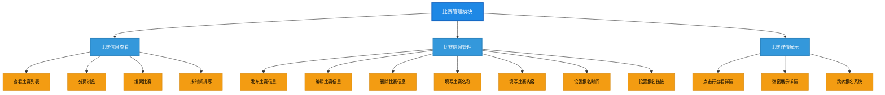
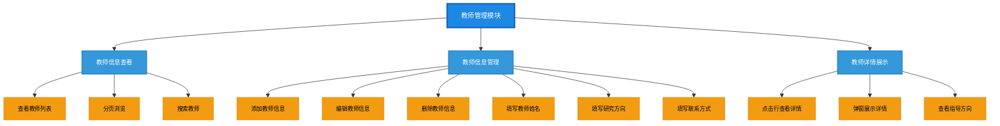

# 创新学分申领管理平台 - 功能结构图

## 一、用户模块功能结构图

```mermaid
graph TB
    UM[用户模块]
    
    UM --> UM1[认证管理]
    UM --> UM2[个人信息管理]
    UM --> UM3[安全中心]
    UM --> UM4[权限管理]
    
    %% 认证管理子功能
    UM1 --> UM1a[用户登录]
    UM1 --> UM1b[用户注册]
    UM1 --> UM1c[退出登录]
    UM1 --> UM1d[JWT令牌验证]
    
    %% 个人信息管理子功能
    UM2 --> UM2a[查看个人信息]
    UM2 --> UM2b[修改头像]
    UM2 --> UM2c[修改昵称]
    UM2 --> UM2d[修改个人简介]
    UM2 --> UM2e[修改联系方式]
    UM2 --> UM2f[修改手机号]
    
    %% 安全中心子功能
    UM3 --> UM3a[修改密码]
    UM3 --> UM3b[绑定手机号]
    UM3 --> UM3c[更换手机号]
    
    %% 权限管理子功能
    UM4 --> UM4a[角色区分]
    UM4 --> UM4b[学生权限]
    UM4 --> UM4c[管理员权限]
    UM4 --> UM4d[指导教师权限]
    
    classDef module fill:#1E88E5,stroke:#1565C0,stroke-width:3px,color:#fff,font-size:14px
    classDef func fill:#3498DB,stroke:#2E86C1,stroke-width:2px,color:#fff,font-size:13px
    classDef subfunc fill:#F39C12,stroke:#D68910,stroke-width:1px,color:#000,font-size:12px
    
    class UM module
    class UM1,UM2,UM3,UM4 func
    class UM1a,UM1b,UM1c,UM1d,UM2a,UM2b,UM2c,UM2d,UM2e,UM2f,UM3a,UM3b,UM3c,UM4a,UM4b,UM4c,UM4d subfunc
```

---

## 二、学分申领功能结构图

```mermaid
graph TB
    CA[学分申领模块]
    
    CA --> CA1[学生申领]
    CA --> CA2[管理员审批]
    CA --> CA3[申领记录管理]
    CA --> CA4[学分统计]
    
    %% 学生申领子功能
    CA1 --> CA1a[填写申领表单]
    CA1 --> CA1b[上传证明图片]
    CA1 --> CA1c[选择所属学年]
    CA1 --> CA1d[输入学分分值]
    CA1 --> CA1e[提交申领申请]
    CA1 --> CA1f[查看申领进度]
    CA1 --> CA1g[查看申领结果]
    
    %% 管理员审批子功能
    CA2 --> CA2a[查看待审批列表]
    CA2 --> CA2b[查看申领详情]
    CA2 --> CA2c[查看证明图片]
    CA2 --> CA2d[审批通过]
    CA2 --> CA2e[审批驳回]
    CA2 --> CA2f[填写审批备注]
    
    %% 申领记录管理子功能
    CA3 --> CA3a[查看申领历史]
    CA3 --> CA3b[按学年筛选]
    CA3 --> CA3c[按状态筛选]
    CA3 --> CA3d[申领状态流转]
    
    %% 学分统计子功能
    CA4 --> CA4a[当前学年学分]
    CA4 --> CA4b[历史学分汇总]
    CA4 --> CA4c[学分排名统计]
    
    classDef module fill:#1E88E5,stroke:#1565C0,stroke-width:3px,color:#fff,font-size:14px
    classDef func fill:#3498DB,stroke:#2E86C1,stroke-width:2px,color:#fff,font-size:13px
    classDef subfunc fill:#F39C12,stroke:#D68910,stroke-width:1px,color:#000,font-size:12px
    
    class CA module
    class CA1,CA2,CA3,CA4 func
    class CA1a,CA1b,CA1c,CA1d,CA1e,CA1f,CA1g,CA2a,CA2b,CA2c,CA2d,CA2e,CA2f,CA3a,CA3b,CA3c,CA3d,CA4a,CA4b,CA4c subfunc
```

---

## 三、比赛管理功能结构图

---

## 四、教师管理功能结构图

---

## 五、技术社区功能结构图

```mermaid
graph TB
    TC[技术社区模块]
    
    TC --> TC1[帖子浏览]
    TC --> TC2[帖子发布]
    TC --> TC3[帖子回复]
    TC --> TC4[帖子管理]
    
    %% 帖子浏览子功能
    TC1 --> TC1a[查看全部帖子]
    TC1 --> TC1b[查看求助帖子]
    TC1 --> TC1c[查看公告帖子]
    TC1 --> TC1d[分页浏览]
    TC1 --> TC1e[点击查看详情]
    TC1 --> TC1f[查看帖子内容]
    
    %% 帖子发布子功能
    TC2 --> TC2a[发布求助帖]
    TC2 --> TC2b[发布公告]
    TC2 --> TC2c[填写帖子标题]
    TC2 --> TC2d[填写帖子内容]
    TC2 --> TC2e[选择帖子类型]
    TC2 --> TC2f[提交发布]
    
    %% 帖子回复子功能
    TC3 --> TC3a[点击回复按钮]
    TC3 --> TC3b[输入回复内容]
    TC3 --> TC3c[提交回复]
    TC3 --> TC3d[查看回复列表]
    TC3 --> TC3e[多条回复支持]
    
    %% 帖子管理子功能
    TC4 --> TC4a[管理我的帖子]
    TC4 --> TC4b[删除帖子]
    TC4 --> TC4c[编辑帖子]
    TC4 --> TC4d[权限控制管理]
    
    classDef module fill:#1E88E5,stroke:#1565C0,stroke-width:3px,color:#fff,font-size:14px
    classDef func fill:#3498DB,stroke:#2E86C1,stroke-width:2px,color:#fff,font-size:13px
    classDef subfunc fill:#F39C12,stroke:#D68910,stroke-width:1px,color:#000,font-size:12px
    
    class TC module
    class TC1,TC2,TC3,TC4 func
    class TC1a,TC1b,TC1c,TC1d,TC1e,TC1f,TC2a,TC2b,TC2c,TC2d,TC2e,TC2f,TC3a,TC3b,TC3c,TC3d,TC3e,TC4a,TC4b,TC4c,TC4d subfunc
```

---

## 六、功能结构说明

### 6.1 各模块功能数量统计

| 模块 | 二级功能 | 三级功能 | 说明 |
|------|---------|---------|------|
| 用户模块 | 4个 | 16个 | 认证、个人信息、安全、权限 |
| 学分申领模块 | 4个 | 19个 | 申领、审批、记录、统计 |
| 比赛管理模块 | 3个 | 14个 | 查看、管理、详情展示 |
| 教师管理模块 | 3个 | 12个 | 查看、管理、详情展示 |
| 技术社区模块 | 4个 | 20个 | 浏览、发布、回复、管理 |

### 6.2 功能层级说明

- **一级**：系统主模块（用户、学分申领、比赛、教师、技术社区）
- **二级**：模块下的功能分组（如认证管理、个人信息管理等）
- **三级**：具体操作功能（如用户登录、上传图片等）

### 6.3 权限划分说明

| 功能 | 学生权限 | 管理员权限 |
|------|:--------:|:----------:|
| 学分申领提交 | ✓ | - |
| 学分审批 | - | ✓ |
| 比赛发布 | - | ✓ |
| 比赛查看 | ✓ | ✓ |
| 教师管理 | - | ✓ |
| 发布求助帖 | ✓ | ✓ |
| 发布公告 | - | ✓ |
| 删除帖子 | - | ✓ |
| 回复帖子 | ✓ | ✓ |

---

**文档说明**：本功能结构图采用树形结构展示各模块的功能分解，使用Mermaid graph TB语法绘制，清晰展示系统的功能层次和功能点分布。