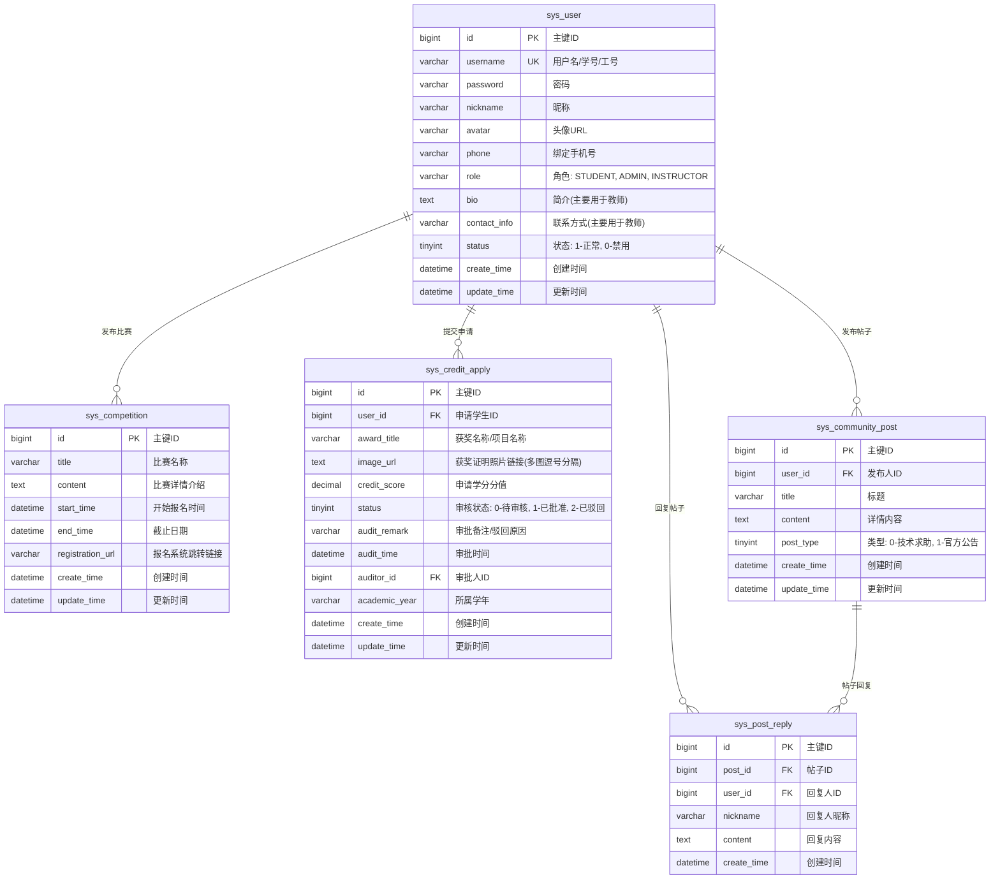
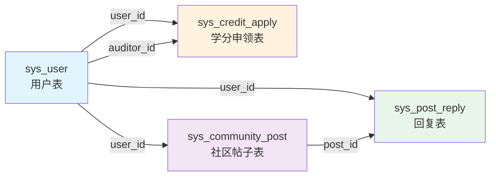
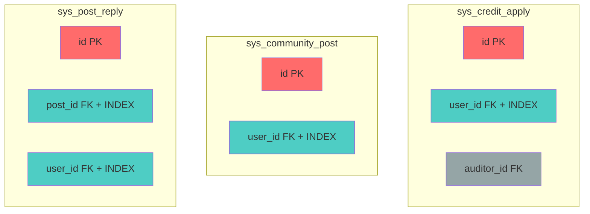
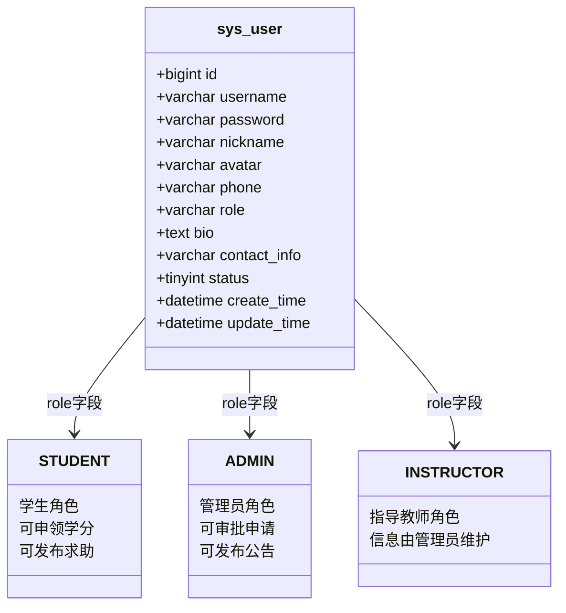
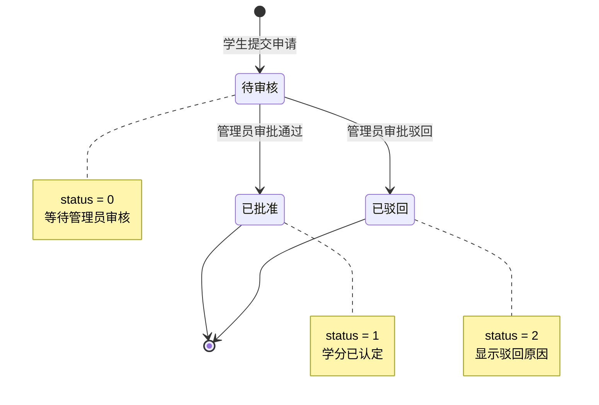
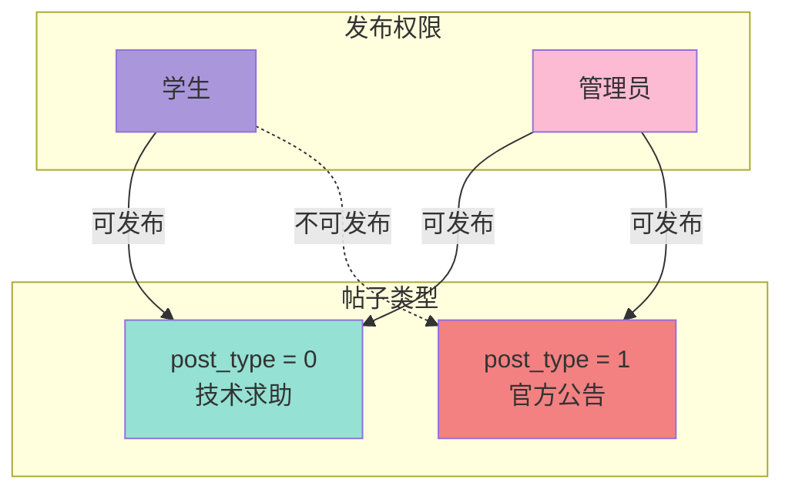
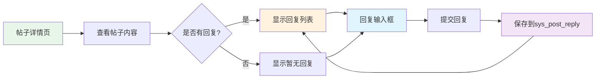
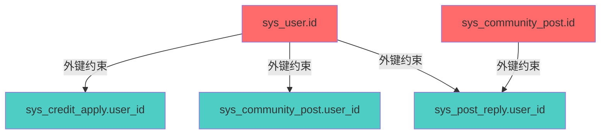
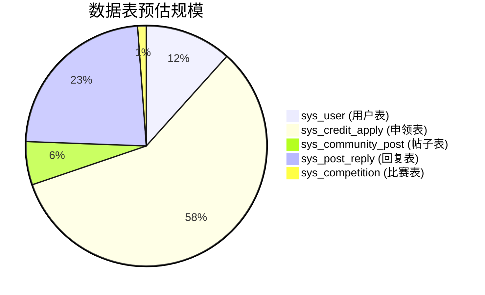

# 创新学分申领管理平台 - 数据库ER图设计

## 一、数据库ER图

使用Mermaid语法绘制的数据库实体关系图：

## 二、表关系说明

### 2.1 核心关系

| 关系 | 类型 | 说明 |
|------|------|------|
| sys_user → sys_credit_apply | 一对多 | 一个学生可以提交多条学分申请记录 |
| sys_user → sys_community_post | 一对多 | 一个用户可以发布多条社区帖子 |
| sys_user → sys_post_reply | 一对多 | 一个用户可以发布多条帖子回复 |
| sys_user → sys_competition | 一对多 | 一个管理员可以发布多条比赛信息 |
| sys_community_post → sys_post_reply | 一对多 | 一条帖子可以有多条回复 |

### 2.2 外键关系图

## 三、索引设计

### 3.1 主键索引

所有表均使用 `bigint id` 作为自增主键，建立主键索引。

### 3.2 外键索引

为了提升查询性能，在外键字段上建立索引：

| 表名 | 索引名 | 字段 | 说明 |
|------|--------|------|------|
| sys_credit_apply | idx_user_id | user_id | 加速按学生查询申领记录 |
| sys_community_post | idx_user_id | user_id | 加速按用户查询帖子 |
| sys_post_reply | idx_post_id | post_id | 加速按帖子查询回复 |
| sys_post_reply | idx_user_id | user_id | 加速按用户查询回复 |

### 3.3 索引可视化

## 四、数据表详细设计

### 4.1 sys_user（用户表）

**字段说明**：

- `username`：学号或工号，全局唯一
- `role`：角色类型，支持三种角色
  - STUDENT：学生
  - ADMIN：管理员
  - INSTRUCTOR：指导教师
- `bio` 和 `contact_info`：主要用于教师角色，存储教师简介和联系方式

### 4.2 sys_credit_apply（学分申领表）

**状态流转说明**：

- `status` 字段控制申领状态
  - 0：待审核，学生提交后的初始状态
  - 1：已批准，管理员审核通过
  - 2：已驳回，管理员审核驳回，需填写驳回原因

### 4.3 sys_community_post（社区帖子表）

**帖子类型说明**：

- `post_type` 字段区分帖子类型
  - 0：技术求助帖，学生和管理员均可发布
  - 1：官方公告帖，仅管理员可发布

### 4.4 sys_post_reply（帖子回复表）

**回复功能说明**：

- 一条帖子可以有多条回复
- 回复按创建时间升序排列
- 回复内容包含回复人昵称和内容

## 五、数据字典

### 5.1 角色类型字典

| 值 | 名称 | 说明 |
|------|------|------|
| STUDENT | 学生 | 系统主要使用者，可申领学分、发布求助 |
| ADMIN | 管理员 | 系统管理者，可审批、发布公告、管理数据 |
| INSTRUCTOR | 指导教师 | 信息由管理员维护，供学生查看 |

### 5.2 申领状态字典

| 值 | 名称 | 说明 |
|------|------|------|
| 0 | 待审核 | 学生提交后的初始状态，等待管理员审核 |
| 1 | 已批准 | 管理员审核通过，学分已认定 |
| 2 | 已驳回 | 管理员审核驳回，需查看驳回原因 |

### 5.3 帖子类型字典

| 值 | 名称 | 发布权限 |
|------|------|------|
| 0 | 技术求助 | 学生、管理员均可发布 |
| 1 | 官方公告 | 仅管理员可发布 |

### 5.4 用户状态字典

| 值 | 名称 | 说明 |
|------|------|------|
| 1 | 正常 | 用户账号正常可用 |
| 0 | 禁用 | 用户账号被禁用，无法登录 |

## 六、数据完整性约束

### 6.1 实体完整性

- 所有表的主键 `id` 设置为自增，保证唯一性
- 用户表的 `username` 字段设置唯一约束，避免重复注册

### 6.2 参照完整性

**外键约束说明**：

- `sys_credit_apply.user_id` 必须关联有效的 `sys_user.id`
- `sys_community_post.user_id` 必须关联有效的 `sys_user.id`
- `sys_post_reply.post_id` 必须关联有效的 `sys_community_post.id`
- `sys_post_reply.user_id` 必须关联有效的 `sys_user.id`

### 6.3 域完整性

| 字段 | 约束 | 说明 |
|------|------|------|
| username | NOT NULL, UNIQUE | 用户名不能为空且必须唯一 |
| password | NOT NULL | 密码不能为空 |
| role | NOT NULL | 角色不能为空，必须为指定值之一 |
| award_title | NOT NULL | 获奖名称不能为空 |
| image_url | NOT NULL | 获奖证明图片不能为空 |
| title | NOT NULL | 帖子标题不能为空 |
| content | NOT NULL | 帖子内容不能为空 |

## 七、数据量估算

### 7.1 预估数据规模

### 7.2 容量规划

| 表名 | 预估记录数 | 单条记录大小 | 预估容量 |
|------|-----------|-------------|---------|
| sys_user | 1,000 | 500B | 500KB |
| sys_credit_apply | 5,000 | 1KB | 5MB |
| sys_community_post | 500 | 2KB | 1MB |
| sys_post_reply | 2,000 | 500B | 1MB |
| sys_competition | 100 | 2KB | 200KB |

**总计预估容量**：约 7.7MB，MySQL 容量规划充足。

---

**文档版本**：v1.0  
**创建日期**：2026年6月25日  
**创建人**：项目开发团队