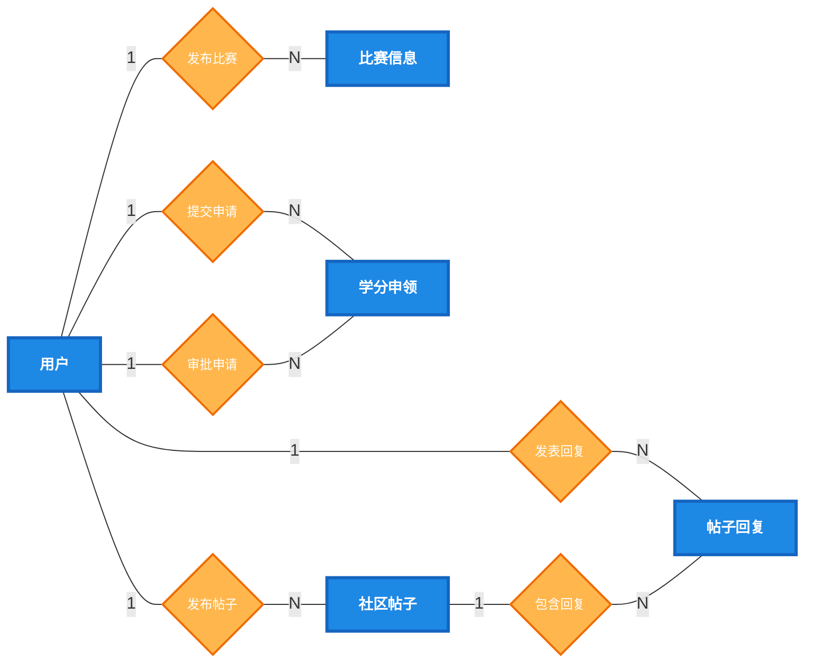
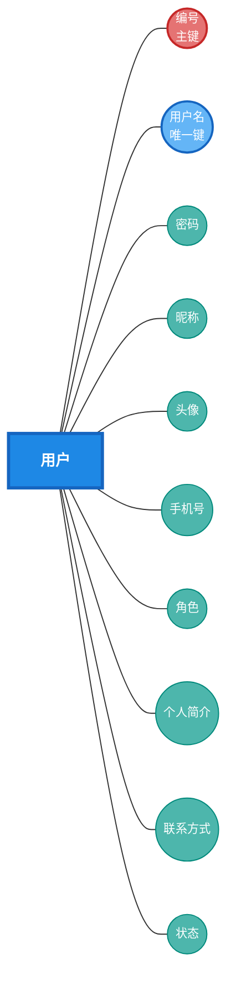
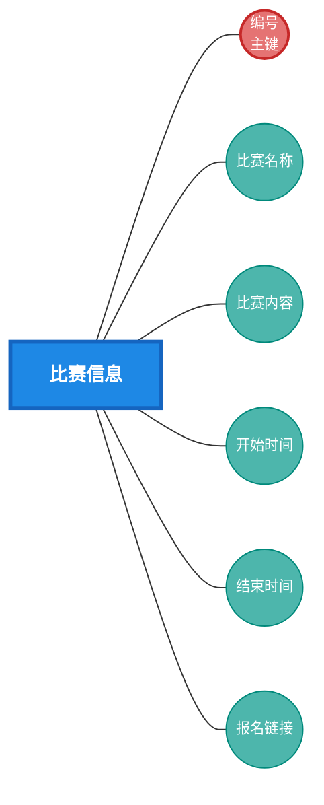
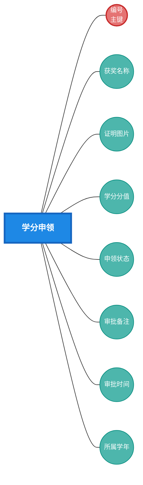
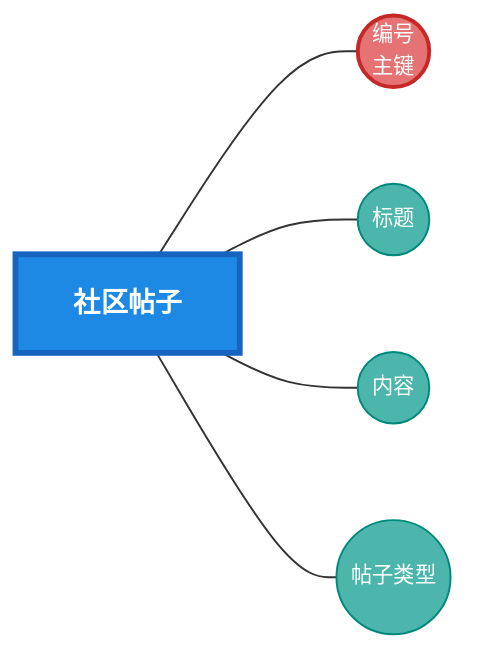
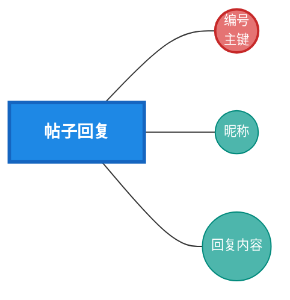
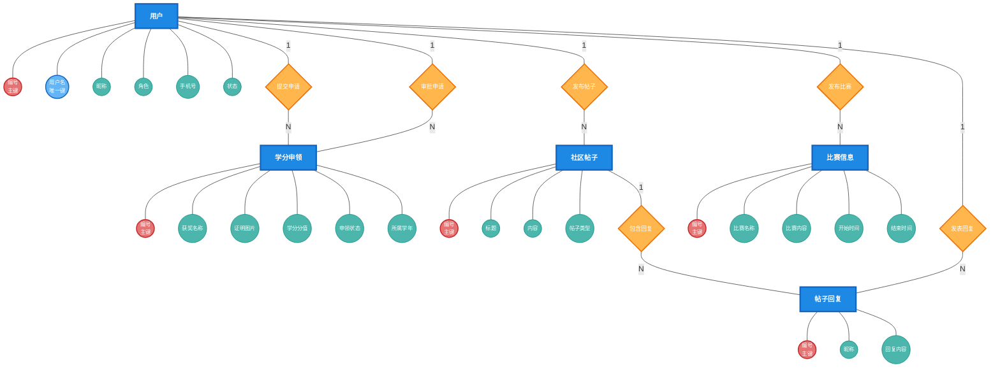

# 创新学分申领管理平台 - 概念模型ER图

## 一、完整概念模型ER图

使用经典Chen记号法（矩形=实体，椭圆=属性，菱形=关系）绘制的概念模型：

## 二、实体属性图

### 2.1 用户实体

### 2.2 比赛信息实体

### 2.3 学分申领实体

### 2.4 社区帖子实体

### 2.5 帖子回复实体

## 三、完整概念模型（含属性）

## 四、关系说明

| 关系 | 连接实体 | 基数 | 说明 |
|------|----------|------|------|
| 提交申请 | 用户 ↔ 学分申领 | 1 : N | 一个学生可提交多条学分申领 |
| 审批申请 | 用户 ↔ 学分申领 | 1 : N | 一个管理员可审批多条申领记录 |
| 发布帖子 | 用户 ↔ 社区帖子 | 1 : N | 一个用户可发布多条社区帖子 |
| 发布比赛 | 用户 ↔ 比赛信息 | 1 : N | 一个管理员可发布多条比赛信息 |
| 发表回复 | 用户 ↔ 帖子回复 | 1 : N | 一个用户可发表多条帖子回复 |
| 包含回复 | 社区帖子 ↔ 帖子回复 | 1 : N | 一个帖子可包含多条回复内容 |

## 五、符号说明

| 符号 | 图形 | 含义 | 颜色 |
|------|------|------|------|
| 实体 | 矩形 | 表示现实世界中的对象或概念 | 蓝色填充 |
| 属性 | 椭圆 | 表示实体的特征或性质 | 青色填充 |
| 主键 | 红色椭圆 | 唯一标识实体的属性 | 红色填充 |
| 唯一键 | 蓝色椭圆 | 取值唯一的属性 | 浅蓝填充 |
| 关系 | 菱形 | 表示实体间的联系 | 橙色填充 |
| 连线 | 直线 | 连接实体、属性和关系 | 灰色 |
| 基数 | 1/N | 标注在线上，表示一对一或一对多 | - |

---

**文档说明**：本概念模型ER图采用经典Chen记号法，聚焦于业务概念层面的实体、属性与关系，省略了外键字段和审计字段（创建时间/更新时间），突出展示系统的核心业务语义。完整物理数据模型请参考 [ER图.md](file:///d:/Code/credit-system/图表设计/ER图.md)。
