# 创新学分申领管理平台 - 用例图

## 一、系统总体用例图

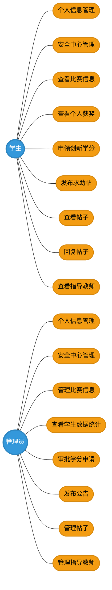

---

## 二、学生用例图

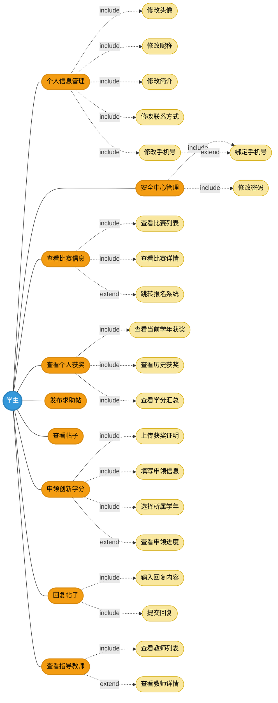

---

## 三、管理员用例图

```mermaid
graph LR
    Admin((管理员))
    
    %% 个人信息管理
    UC1([个人信息管理])
    UC1a([修改头像])
    UC1b([修改昵称])
    UC1c([修改简介])
    
    %% 安全中心
    UC2([安全中心管理])
    UC2a([修改密码])
    UC2b([绑定手机号])
    
    %% 比赛信息管理
    UC3([管理比赛信息])
    UC3a([添加比赛])
    UC3b([查看比赛])
    UC3c([修改比赛])
    UC3d([删除比赛])
    
    %% 学生信息管理
    UC4([查看学生数据统计])
    UC4a([查看学生列表])
    UC4b([查看学生获奖])
    UC4c([查看学生学分])
    UC4d([按学年查询])
    UC4e([查看统计图表])
    UC4f([查看状态分布])
    
    %% 学分审批
    UC5([审批学分申请])
    UC5a([查看待审核列表])
    UC5b([查看申领详情])
    UC5c([批准申请])
    UC5d([驳回申请])
    UC5e([填写审批备注])
    
    %% 技术社区管理
    UC6([管理技术社区])
    UC6a([查看所有帖子])
    UC6b([删除帖子])
    UC6c([发布公告])
    UC6d([查看求助帖])
    
    %% 指导教师管理
    UC7([管理指导教师])
    UC7a([添加教师])
    UC7b([查看教师列表])
    UC7c([修改教师信息])
    UC7d([删除教师])
    
    %% 关系
    Admin --- UC1
    Admin --- UC2
    Admin --- UC3
    Admin --- UC4
    Admin --- UC5
    Admin --- UC6
    Admin --- UC7
    
    UC1 -.->|include| UC1a
    UC1 -.->|include| UC1b
    UC1 -.->|include| UC1c
    
    UC2 -.->|include| UC2a
    UC2 -.->|include| UC2b
    
    UC3 -.->|include| UC3a
    UC3 -.->|include| UC3b
    UC3 -.->|include| UC3c
    UC3 -.->|include| UC3d
    
    UC4 -.->|include| UC4a
    UC4 -.->|include| UC4b
    UC4 -.->|include| UC4c
    UC4 -.->|extend| UC4d
    UC4 -.->|include| UC4e
    UC4 -.->|include| UC4f
    
    UC5 -.->|include| UC5a
    UC5 -.->|include| UC5b
    UC5 -.->|extend| UC5c
    UC5 -.->|extend| UC5d
    UC5 -.->|include| UC5e
    
    UC6 -.->|include| UC6a
    UC6 -.->|extend| UC6b
    UC6 -.->|extend| UC6c
    UC6 -.->|include| UC6d
    
    UC7 -.->|include| UC7a
    UC7 -.->|include| UC7b
    UC7 -.->|include| UC7c
    UC7 -.->|include| UC7d
    
    classDef actor fill:#E74C3C,stroke:#C0392B,stroke-width:3px,color:white
    classDef usecase fill:#F39C12,stroke:#D68910,stroke-width:2px,color:black
    classDef subusecase fill:#F9E79F,stroke:#D4AC0D,stroke-width:1px,color:black
    
    class Admin actor
    class UC1,UC2,UC3,UC4,UC5,UC6,UC7 usecase
    class UC1a,UC1b,UC1c,UC2a,UC2b,UC3a,UC3b,UC3c,UC3d,UC4a,UC4b,UC4c,UC4d,UC4e,UC4f,UC5a,UC5b,UC5c,UC5d,UC5e,UC6a,UC6b,UC6c,UC6d,UC7a,UC7b,UC7c,UC7d subusecase
```

---

## 四、核心业务用例图

### 4.1 学分申领审批用例图

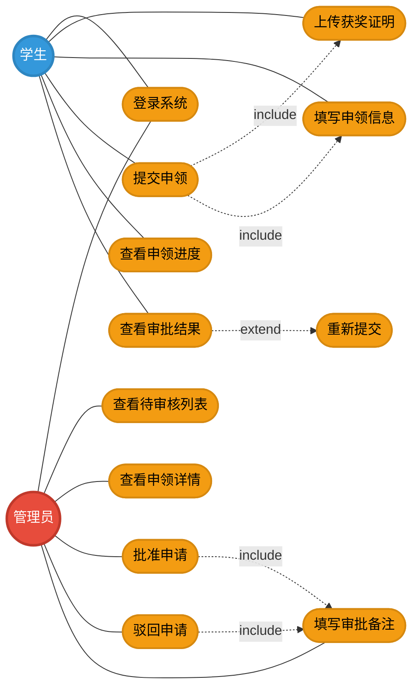

### 4.2 技术社区互动用例图

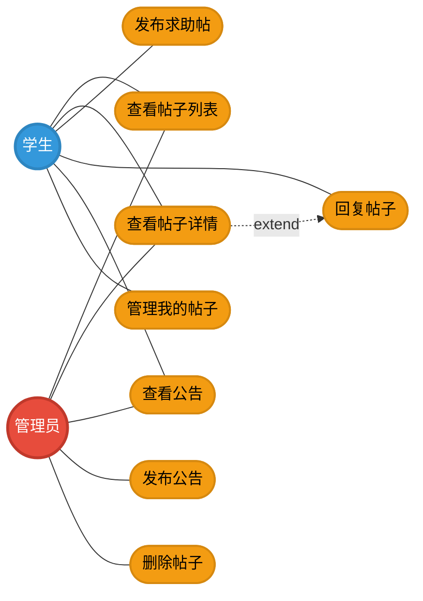

### 4.3 比赛信息管理用例图

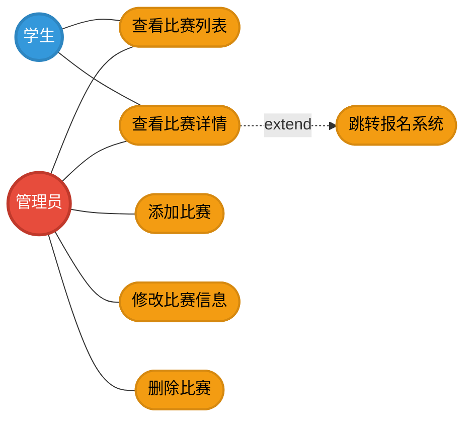

### 4.4 数据统计与可视化用例图

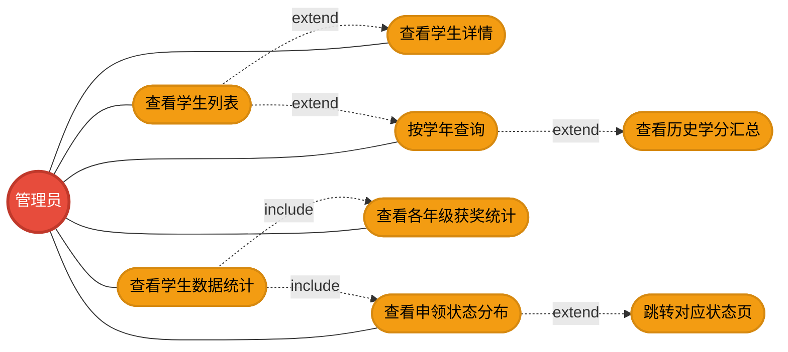

### 4.5 指导教师管理用例图

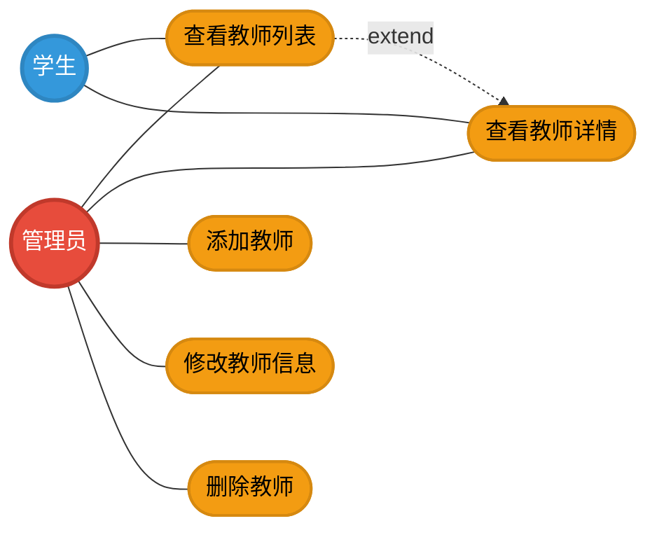

### 4.6 个人信息与安全中心用例图

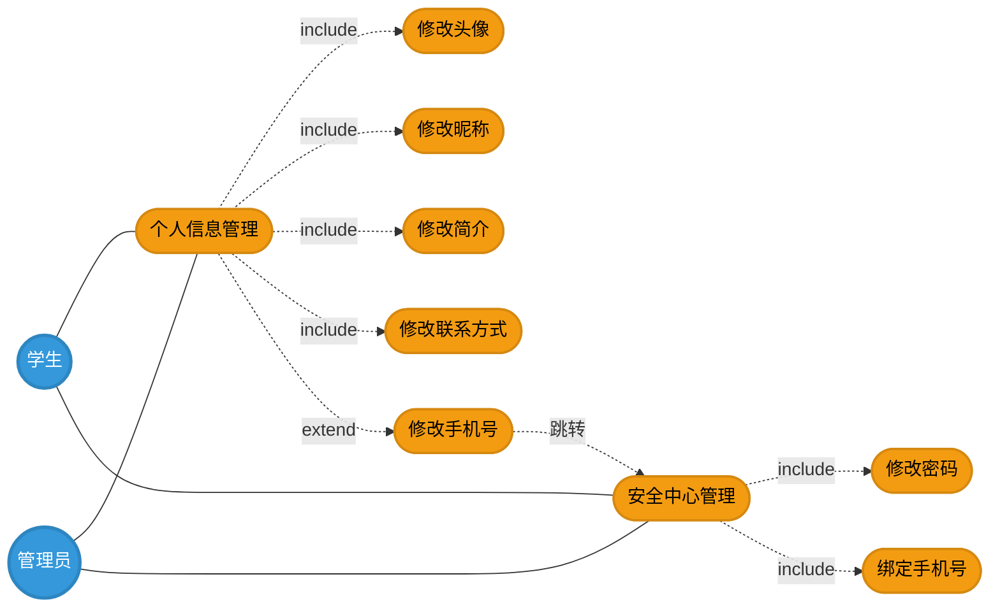

---

## 五、用例描述

### 5.1 学分申领用例描述

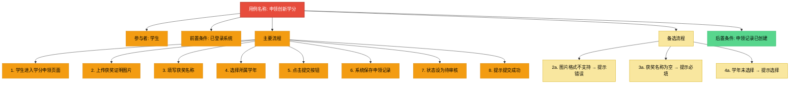

### 5.2 学分审批用例描述

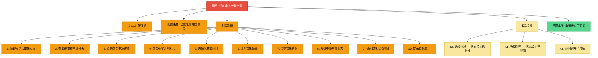

### 5.3 发布帖子用例描述

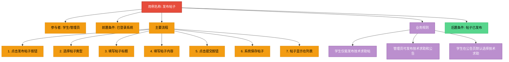

---

## 六、用例关系说明

### 6.1 关系类型

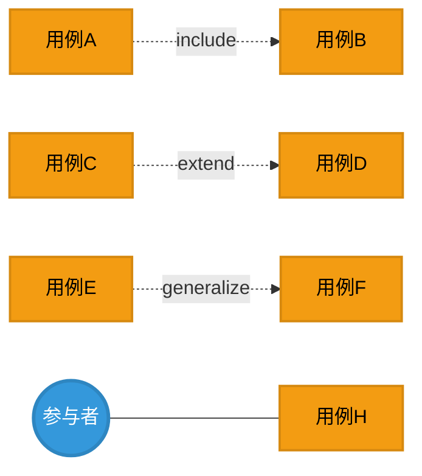

**关系说明**：

| 关系类型 | 箭头方向 | 说明 |
|---------|---------|------|
| 关联 | 实线 | 参与者与用例之间的关系 |
| 包含 | 虚线 `-.->&#124;include&#124;` | 一个用例总是执行另一个用例 |
| 扩展 | 虚线 `-.->&#124;extend&#124;` | 一个用例在特定条件下执行另一个用例 |
| 泛化 | 实线箭头 | 一个用例继承另一个用例的行为 |

### 6.2 主要用例关系

| 基础用例 | 关系 | 目标用例 | 说明 |
|---------|------|---------|------|
| 个人信息管理 | include | 修改头像 | 个人信息管理必然包含修改头像 |
| 个人信息管理 | extend | 修改手机号 | 修改手机号是可选的，需跳转安全中心 |
| 安全中心管理 | include | 修改密码 | 安全中心必然包含修改密码 |
| 申领创新学分 | include | 上传获奖证明 | 申领必然包含上传证明 |
| 查看帖子详情 | extend | 回复帖子 | 查看详情后可选择回复 |
| 查看比赛详情 | extend | 跳转报名系统 | 查看详情后可选择跳转 |
| 审批学分申请 | extend | 批准申请 | 审批可选批准 |
| 审批学分申请 | extend | 驳回申请 | 审批可选驳回 |
| 查看申领状态分布 | extend | 跳转对应状态页 | 查看分布后可跳转 |

---

## 七、参与者与用例对照表

### 7.1 学生用例对照

| 序号 | 用例名称 | 说明 | 包含关系 | 扩展关系 |
|------|---------|------|---------|---------|
| 1 | 个人信息管理 | 管理个人基本信息 | 修改头像、昵称、简介、联系方式 | 修改手机号（跳转安全中心） |
| 2 | 安全中心管理 | 管理账号安全 | 修改密码、绑定手机号 | - |
| 3 | 查看比赛信息 | 查看比赛列表和详情 | 查看比赛列表、详情 | 跳转报名系统 |
| 4 | 查看个人获奖 | 查看获奖记录和学分 | 当前学年获奖、历史获奖、学分汇总 | - |
| 5 | 申领创新学分 | 提交学分申请 | 上传证明、填写信息、选择学年 | 查看申领进度 |
| 6 | 发布求助帖 | 发布技术求助 | - | - |
| 7 | 查看帖子 | 浏览社区帖子 | - | - |
| 8 | 回复帖子 | 回复他人帖子 | 输入内容、提交回复 | - |
| 9 | 查看指导教师 | 查看教师信息 | 查看教师列表 | 查看教师详情 |

### 7.2 管理员用例对照

| 序号 | 用例名称 | 说明 | 包含关系 | 扩展关系 |
|------|---------|------|---------|---------|
| 1 | 个人信息管理 | 管理个人信息 | 修改头像、昵称、简介 | - |
| 2 | 安全中心管理 | 管理账号安全 | 修改密码、绑定手机号 | - |
| 3 | 管理比赛信息 | CRUD操作比赛 | 添加、查看、修改、删除比赛 | - |
| 4 | 查看学生数据统计 | 查看学生数据和图表 | 学生列表、获奖、学分、统计图表 | 按学年查询、历史学分汇总 |
| 5 | 审批学分申请 | 审批学分申领 | 查看待审核、详情、填写备注 | 批准、驳回 |
| 6 | 管理技术社区 | 管理社区帖子 | 查看所有帖子、查看求助帖 | 删除帖子、发布公告 |
| 7 | 管理指导教师 | CRUD操作教师 | 添加、查看、修改、删除教师 | - |

---

**文档版本**：v1.0  
**创建日期**：2026年6月25日  
**创建人**：项目开发团队