# 创新学分申领管理平台 - 系统功能图

## 一、系统总体功能结构图

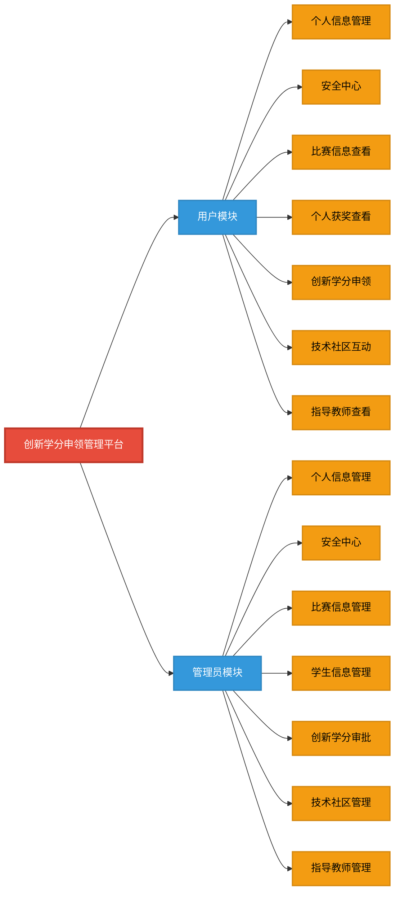

---

## 二、学生模块功能分解图

```mermaid
graph TB
    Student[学生模块]
    
    Student --> S1[个人信息管理]
    Student --> S2[安全中心]
    Student --> S3[比赛信息查看]
    Student --> S4[个人获奖查看]
    Student --> S5[创新学分申领]
    Student --> S6[技术社区互动]
    Student --> S7[指导教师查看]
    
    %% 个人信息管理子功能
    S1 --> S1a[修改头像]
    S1 --> S1b[修改昵称]
    S1 --> S1c[修改个人简介]
    S1 --> S1d[修改联系方式]
    S1 --> S1e[修改手机号<br/>跳转安全中心]
    
    %% 安全中心子功能
    S2 --> S2a[修改密码]
    S2 --> S2b[绑定手机号]
    S2 --> S2c[更换手机号]
    
    %% 比赛信息查看子功能
    S3 --> S3a[查看比赛列表]
    S3 --> S3b[查看比赛详情]
    S3 --> S3c[跳转报名系统]
    
    %% 个人获奖查看子功能
    S4 --> S4a[查看当前学年获奖]
    S4 --> S4b[查看历史获奖记录]
    S4 --> S4c[查看创新学分汇总]
    
    %% 创新学分申领子功能
    S5 --> S5a[上传获奖证明]
    S5 --> S5b[填写申领信息]
    S5 --> S5c[选择所属学年]
    S5 --> S5d[查看申领进度]
    S5 --> S5e[查看当前学分]
    
    %% 技术社区互动子功能
    S6 --> S6a[发布求助帖]
    S6 --> S6b[查看求助帖]
    S6 --> S6c[查看公告]
    S6 --> S6d[回复帖子]
    S6 --> S6e[管理我的帖子]
    
    %% 指导教师查看子功能
    S7 --> S7a[查看教师列表]
    S7 --> S7b[查看教师详情]
    
    classDef module fill:#3498DB,stroke:#2E86C1,stroke-width:3px,color:white
    classDef func fill:#F39C12,stroke:#D68910,stroke-width:2px,color:black
    classDef subfunc fill:#58D68D,stroke:#28B463,stroke-width:1px,color:black
    
    class Student module
    class S1,S2,S3,S4,S5,S6,S7 func
    class S1a,S1b,S1c,S1d,S1e,S2a,S2b,S2c,S3a,S3b,S3c,S4a,S4b,S4c,S5a,S5b,S5c,S5d,S5e,S6a,S6b,S6c,S6d,S6e,S7a,S7b subfunc
```

---

## 三、管理员模块功能分解图

```mermaid
graph TB
    Admin[管理员模块]
    
    Admin --> A1[个人信息管理]
    Admin --> A2[安全中心]
    Admin --> A3[比赛信息管理]
    Admin --> A4[学生信息管理]
    Admin --> A5[创新学分审批]
    Admin --> A6[技术社区管理]
    Admin --> A7[指导教师管理]
    
    %% 个人信息管理子功能
    A1 --> A1a[修改头像]
    A1 --> A1b[修改昵称]
    A1 --> A1c[修改个人简介]
    A1 --> A1d[修改联系方式]
    
    %% 安全中心子功能
    A2 --> A2a[修改密码]
    A2 --> A2b[绑定手机号]
    
    %% 比赛信息管理子功能
    A3 --> A3a[添加比赛]
    A3 --> A3b[查看比赛列表]
    A3 --> A3c[修改比赛信息]
    A3 --> A3d[删除比赛]
    
    %% 学生信息管理子功能
    A4 --> A4a[查看学生列表]
    A4 --> A4b[查看学生获奖情况]
    A4 --> A4c[查看学生学分情况]
    A4 --> A4d[按学年查询统计]
    A4 --> A4e[各年级获奖统计图表]
    A4 --> A4f[申领状态分布图]
    
    %% 创新学分审批子功能
    A5 --> A5a[查看待审核申请]
    A5 --> A5b[查看申领详情]
    A5 --> A5c[批准申请]
    A5 --> A5d[驳回申请]
    A5 --> A5e[填写审批备注]
    
    %% 技术社区管理子功能
    A6 --> A6a[查看所有帖子]
    A6 --> A6b[删除帖子]
    A6 --> A6c[发布公告]
    A6 --> A6d[查看求助帖]
    
    %% 指导教师管理子功能
    A7 --> A7a[添加教师]
    A7 --> A7b[查看教师列表]
    A7 --> A7c[修改教师信息]
    A7 --> A7d[删除教师]
    
    classDef module fill:#E74C3C,stroke:#C0392B,stroke-width:3px,color:white
    classDef func fill:#F39C12,stroke:#D68910,stroke-width:2px,color:black
    classDef subfunc fill:#BB8FCE,stroke:#7D3C98,stroke-width:1px,color:white
    
    class Admin module
    class A1,A2,A3,A4,A5,A6,A7 func
    class A1a,A1b,A1c,A1d,A2a,A2b,A3a,A3b,A3c,A3d,A4a,A4b,A4c,A4d,A4e,A4f,A5a,A5b,A5c,A5d,A5e,A6a,A6b,A6c,A6d,A7a,A7b,A7c,A7d subfunc
```

---

## 四、系统功能流程图

### 4.1 学分申领流程

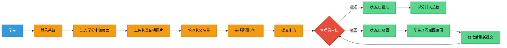

### 4.2 技术社区互动流程

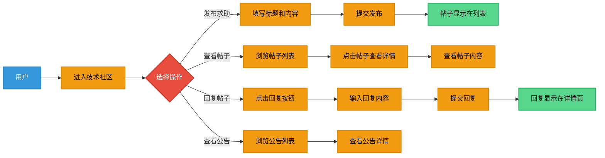

### 4.3 用户认证流程

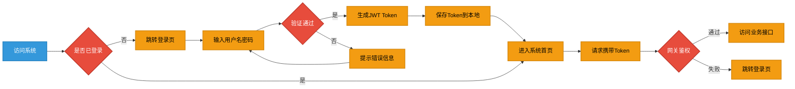

---

## 五、功能权限矩阵

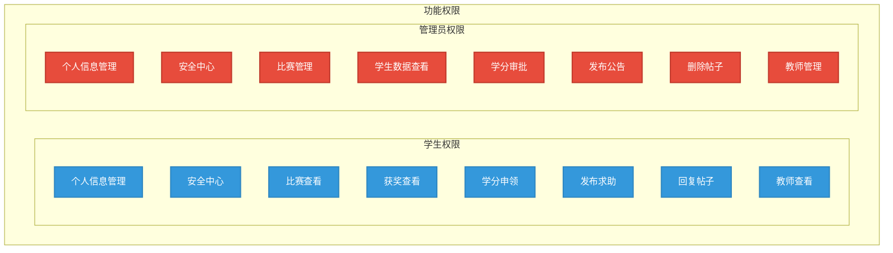

---

## 六、功能模块说明

### 6.1 个人信息管理

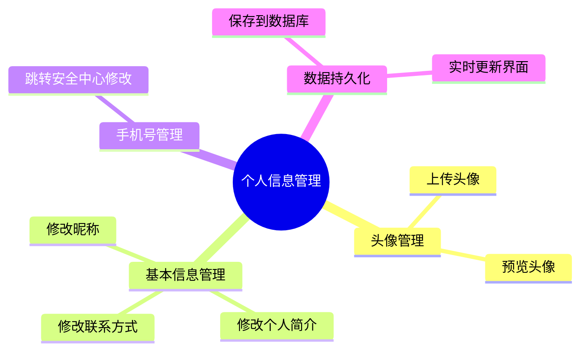

### 6.2 创新学分申领

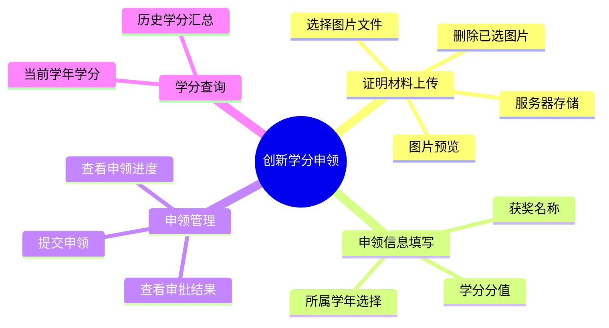

### 6.3 技术社区互动

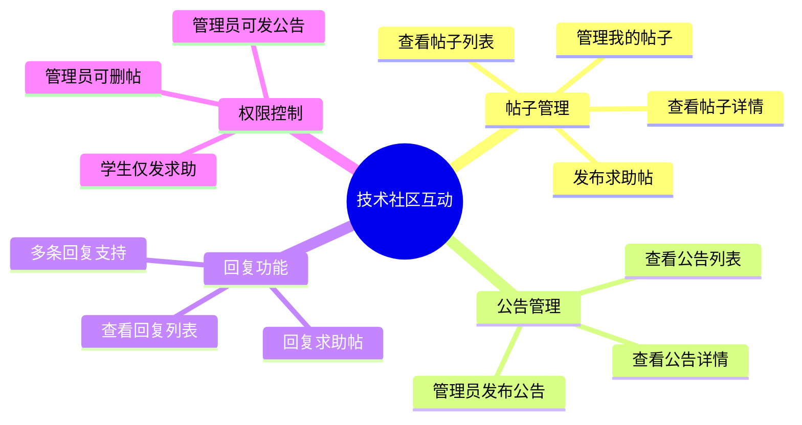

### 6.4 数据统计与可视化

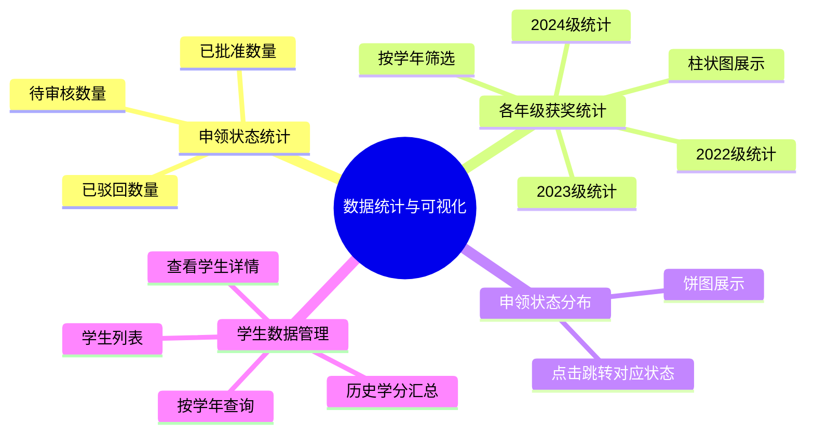

---

## 七、系统功能清单

### 7.1 学生功能清单

| 序号 | 功能模块 | 子功能 | 说明 |
|------|---------|--------|------|
| 1 | 个人信息管理 | 修改头像 | 上传并预览头像 |
| 2 | 个人信息管理 | 修改昵称 | 修改显示昵称 |
| 3 | 个人信息管理 | 修改简介 | 修改个人简介信息 |
| 4 | 个人信息管理 | 修改联系方式 | 修改联系邮箱等 |
| 5 | 安全中心 | 修改密码 | 修改登录密码 |
| 6 | 安全中心 | 绑定手机号 | 绑定或更换手机号 |
| 7 | 比赛信息 | 查看比赛列表 | 分页查看比赛 |
| 8 | 比赛信息 | 查看比赛详情 | 查看详细信息 |
| 9 | 比赛信息 | 跳转报名系统 | 点击跳转外部链接 |
| 10 | 个人获奖 | 查看获奖记录 | 查看历史获奖 |
| 11 | 个人获奖 | 查看学分汇总 | 查看学分总数 |
| 12 | 创新学分申领 | 上传证明图片 | 上传获奖证明 |
| 13 | 创新学分申领 | 填写申领信息 | 填写获奖名称等 |
| 14 | 创新学分申领 | 选择所属学年 | 选择学年 |
| 15 | 创新学分申领 | 查看申领进度 | 查看审核状态 |
| 16 | 技术社区 | 发布求助帖 | 发布技术求助 |
| 17 | 技术社区 | 查看帖子 | 浏览帖子列表 |
| 18 | 技术社区 | 回复帖子 | 回复他人帖子 |
| 19 | 技术社区 | 管理帖子 | 管理我的发布 |
| 20 | 指导教师 | 查看教师列表 | 浏览教师列表 |
| 21 | 指导教师 | 查看教师详情 | 查看教师详细信息 |

### 7.2 管理员功能清单

| 序号 | 功能模块 | 子功能 | 说明 |
|------|---------|--------|------|
| 1 | 个人信息管理 | 修改个人信息 | 头像、昵称等 |
| 2 | 安全中心 | 修改密码 | 修改登录密码 |
| 3 | 安全中心 | 绑定手机号 | 绑定或更换手机号 |
| 4 | 比赛信息管理 | 添加比赛 | 新增比赛信息 |
| 5 | 比赛信息管理 | 查看比赛 | 查看比赛列表 |
| 6 | 比赛信息管理 | 修改比赛 | 编辑比赛信息 |
| 7 | 比赛信息管理 | 删除比赛 | 删除比赛记录 |
| 8 | 学生信息管理 | 查看学生列表 | 查看所有学生 |
| 9 | 学生信息管理 | 查看获奖情况 | 查看学生获奖 |
| 10 | 学生信息管理 | 查看学分情况 | 查看学生学分 |
| 11 | 学生信息管理 | 学年查询 | 按学年筛选数据 |
| 12 | 学生信息管理 | 各年级获奖统计 | 统计图表展示 |
| 13 | 学生信息管理 | 申领状态分布 | 状态分布图 |
| 14 | 创新学分审批 | 查看待审核 | 查看待审申请 |
| 15 | 创新学分审批 | 查看申领详情 | 查看详细信息 |
| 16 | 创新学分审批 | 批准申请 | 审批通过 |
| 17 | 创新学分审批 | 驳回申请 | 审批驳回 |
| 18 | 创新学分审批 | 填写审批备注 | 填写审批意见 |
| 19 | 技术社区管理 | 查看所有帖子 | 查看全部帖子 |
| 20 | 技术社区管理 | 删除帖子 | 删除违规帖子 |
| 21 | 技术社区管理 | 发布公告 | 发布官方公告 |
| 22 | 指导教师管理 | 添加教师 | 新增教师信息 |
| 23 | 指导教师管理 | 查看教师列表 | 查看所有教师 |
| 24 | 指导教师管理 | 修改教师信息 | 编辑教师信息 |
| 25 | 指导教师管理 | 删除教师 | 删除教师记录 |

---

**文档版本**：v1.0  
**创建日期**：2026年6月25日  
**创建人**：项目开发团队